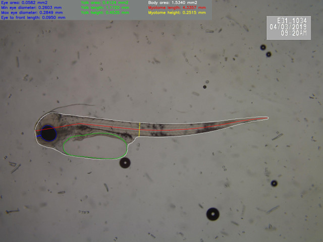
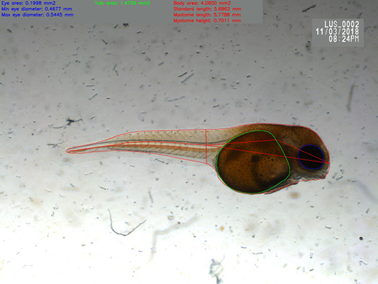
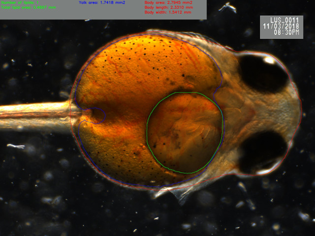

# Welcome to AutoMOMI (Automated Morphometrics On Microscope Images) powered by Mask R-CNN!

AutoMOMI is a software for fully automated morphometrics of microscope images
of different species og larvae and zoo plankton. The software is
powered
[Mask R-CNN](https://github.com/matterport/Mask_RCNN), a state-of-art
image detection and segmentation neural net architecture designed by
Facebook Research.

The following species are supported:
- Cod larvae (side view)
- Lumpsucker larvae (side view & ventral view)
- Zebrafish larvae (side view)
- Wrasse larvae (side view)
- Calanus (side view)

## Getting started

### Requirements:
The package requirements are listed in [requirements](requirements.txt),
but `read_roi` and `imgaug` is not needed if only the analyse
functionality is being used.

### Analyse
For running a analyse run the following command:

` python3 automatedbiometry.py <species>
--weights=/path/to/weights/file.h5 --image=<Path to files / jpg / tif>
--export=<Path to save output data> --scale=<Image scale, in pix/mm>`

Where:
- species, defines what species to be analysed, e.g "cod". Supported
  species are listed in the introduction.
- weights, corresponding to the species defined, found in
  "nasgul/Miljoteknologi/302004666_MaskRCNN/model".
- image, path to folder of images of image to be analysed.
- export path, the output path for analysed data.
- scale, image magnification factor in pix/mm.

### Train
Scrips for further training of a species neural net can be found in the
[train](train) folder, description of how to use them can be found in the
script header.

### Tools
The contents in the [tools](tools) folder is tools for debugging and
mid-way testing. If you want to use it, don't complain about hard-coded
paths or ugly code ;)

## Output
The output consists of a csv-file containing all the endpoints from each
image, a example file for lumpsucker can be found
[here](example_out_data/20190930T105832_log.csv). The endpoints per
species can be found in the description in each [biometry](biometry)
file. The software also returns the original image with the measurements
printed, example images can be seen under.

### Cod:

### Lumpsucker side:

### Lumpsucker ventral:

